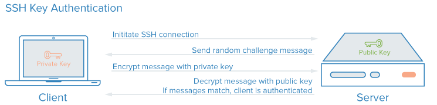
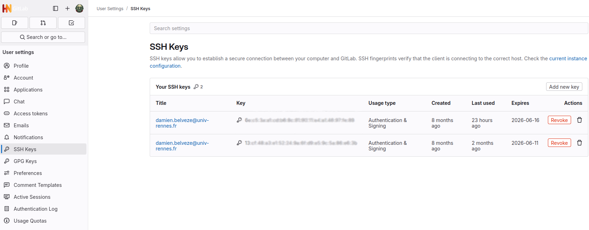
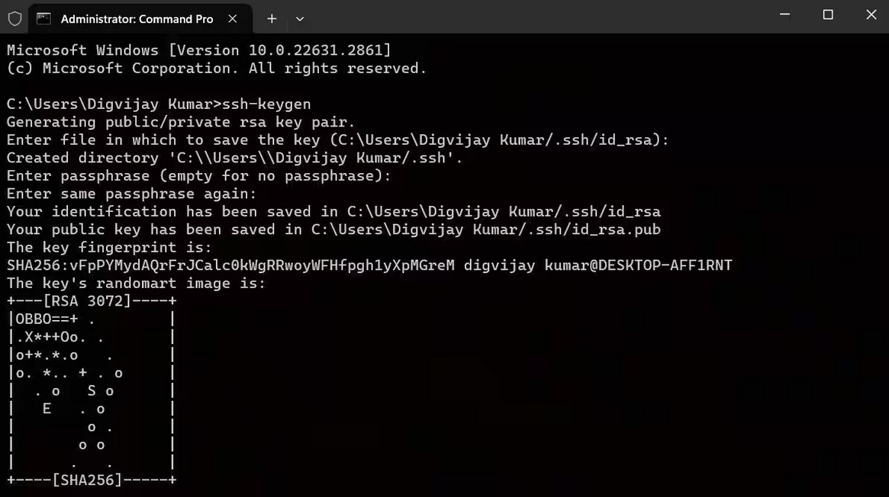
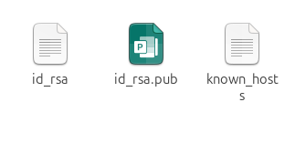

# 2. Accèder à la forge avec le protocole ssh 

La forge est un espace numérique hébergeant un  c'est à dire un dépôt de fichiers distant.
Il y a plusieurs moyens de charger des fichiers sur son ordinateur depuis ce dépôt distant
ou bien d'intervenir en écriture sur ce  ; on distingue en particulier deux protocoles de communication : 

1. **https** :  c'est un protocole sécurisé basé sur http qui est le même que celui que nous utilisons pour consulter une page web. une connexion de ce type requiert un nom d'utilisateur et un mot de passe. 

2. **ssh** : c'est un autre protocole sécurisé basé sur un système de chiffrement (voir plus bas) 
Lorsqu'on travaille en ssh, on ne doit taper cette phrase de passe qu'au début de la session ; après il n'est plus nécessaire de l'entrer. Cela rend la communication entre le dépôt local et le remote plus fluide, que ce soit à travers le terminal ou à travers un environnement d'édition comme Rstudio ou VS codium. 




Le protocole choisi par défaut pour travailler avec un  est spécifié dans le dossier .git : dans le fichier ``config`` en effet, une ligne est relative au protocole utilisé par défaut pour accéder en écriture au remote. 

```{=yaml}
[core]
	repositoryformatversion = 0
	filemode = true
	bare = false
	logallrefupdates = true
[remote "origin"]
	**url = git@gitlab.huma-num.fr:dbelveze/introduction-git-et-gitlab.git**
	fetch = +refs/heads/*:refs/remotes/origin/*
[branch "main"]
	remote = origin
	vscode-merge-base = origin/main
	merge = refs/heads/main
```

Ici on peut voir que le mode de communication prévu est ssh, parce que l'URL commence par ``git@github.com:user/repo.git`` et non par ``https://github.com/user/repo.git``
Si on souhaite modifier le mode d'accès (passer d'une connexion https à une connexion ssh, par exemple), on ne peut pas changer de lien dans l'éditeur de texte directement, il faut le faire dans le fichier config du dépôt git.

Dans la suite des activités, on va prioriser la connexion ssh parce qu'elle est plus sûre et plus rapide pour le développeur ou la développeuse. 

On va donc créer une clé ssh. 

Le protocole ssh est un protocole de chiffrement asymétrique, ce qui signifie qu'il faut non pas *une* clé pour obtenir la connexion mais *deux* ; le statut de chacune de ces clés est différent :

- une clé privée qui ne doit pas quitter votre ordinateur et ne peut être activé que par une phrase de passe (qui ne doit pas quitter votre gestionnaire de mots de passe)

- une clé publique que vous allez associer à votre profil sur github. Il vaut mieux la garder pour vous. J'ai flouté les miennes dans l'image ci-dessous, mais c'est un secret bien moins important que la clé privée. 



Pour générer une paire de clés avec Windows, ouvrir l'invite de commande et taper la commande suivante : 

```bash
$ ssh-keygen
```


Suivre les instructions ; laisser le dossier de destination par défaut.
Créer une phrase de passe et la taper une seconde fois. 

Attention : dans un terminal, on ne voit pas les caractères qu'on tape, on ne voit même pas le masque. C'est comme si on tapait dans le vide, mais quand on appuie sur entrée, les caractères ont bien été pris en compte !

Pour info, le dessin en ASCII est utilisé pour vérifier que la clé utilisée ne change pas. Si le dessin change, c'est que la clé à été changée. Il est plus facile de comparer deux dessins de ce genre qu'une suite de caractères absconse.  


Les clés ont bien été créées, mais où sont-elles ? 

Windows : /<username>/documents/.ssh  
GNU/Linux : /home/<username>/.ssh  
MacOS : /Users/<username>/.ssh  

Dans ce dossier .ssh, on trouve la (ou les) paire(s) de clés et un fichier known_hosts comportant les noms des serveurs pour lesquels ces clés sont actives  :



Ouvrir le fichier .pub et copier le contenu : 

```text
ssh-ed25519 AAAAC3NzaC1lZDI1NTE5AAA..........+MuuZnoI7becabYpsfwM1rDVhSyN7 dbelveze@pr030165
```
revenez à la forge (sur votre profil) et collez la clé ssh dans l'endroit prévu à cet effet. 

Pour github, une fois qu'on est connectés, c'est à cet endroit : https://github.com/settings/keys (sélectionner *settings*, puis *ssh and gpg keys*). Créer une nouvelle clé (*new ssh key*), lui donner un titre et copier le contenu du fichier .pub dans le champ key.

A partir de ce moment, votre protocole d'accès par défaut à github sera ssh. 
Le client qui gère les connexions ssh entre votre machine et les forges que vous utilisez vous demandera à chaque nouvelle session de réactiver la clé privée en entrant votre phrase de passe : sauvegardez bien celle-ci dans un endroit secret (votre cerveau ou un gestionnaire de mots de passe)