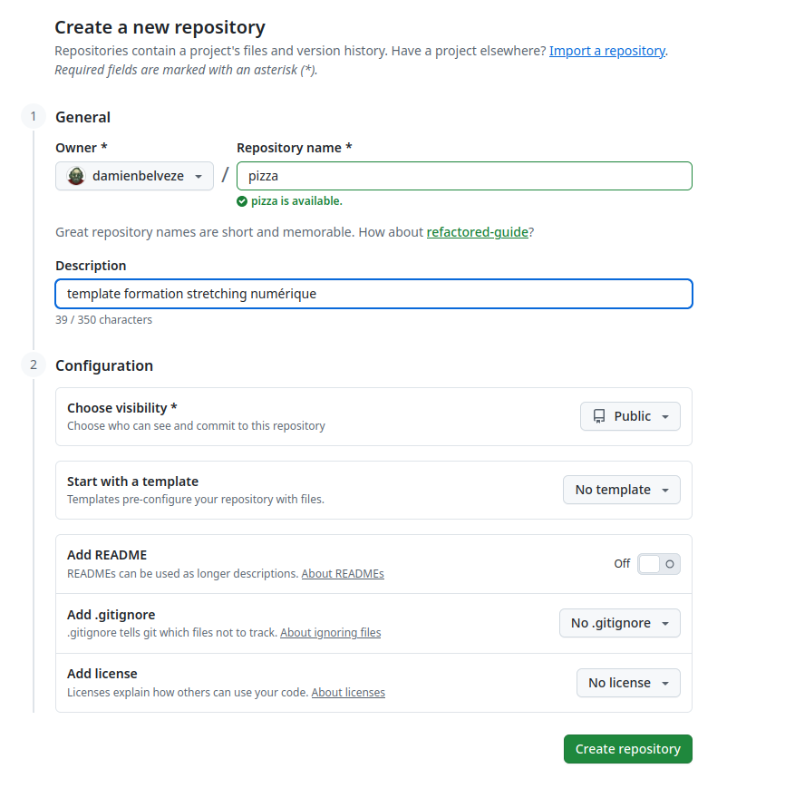

# Créer et gérer un dépôt distant sur Github

## 1. Créer un nouveau dépôt

Aller sur github, authentifiez-vous. 
Cliquez sur le bouton vert *New*
Ajouter un nom au repo(sitory)


apporter une description (c'est surtout pour soi)
On n'a pas besoin d'un repo privé, laissez-le en public.
Pour des raisons de clarté (pour autrui), il est nécessaire d'avoir un fichier README, mais on le générera une autre fois, laisser comme ça (sans README généré au moment de la création)
Pareil pour le fichier .gitignore ; 
le fichier .gitignore est la liste (actuellement vide) de tous les fichiers qui potentiellement doivent rester en local et ne doivent pas être envoyés vers la forge. 
Pareil pour la licence, c'est important, mais on la rajoutera plus tard. 


## 2. Charger des fichiers vers un remote dans une forge

On va connecter le repo en ligne qu'on vient de créer (le *remote*) au repo en local (notre dossier Git)
Pour faire ce lien, depuis le terminal, entrer la commande suivante : 

```bash
$ git remote add origin git@github.com:damienbelveze/pizza.git
```
Si on a déjà un *commit* prêt dans son dossier local, il est prêt à être envoyé vers la forge. 
*origin* fait référence au repo git (voir commande ci-dessus) 

```bash
git push -u origin main # pousse les documents vers la branche main du remote
```

éventuellement la première fois qu'on fait un commit en direction du repo, on est amené à entrer cette commande supplémentaire. C'est le cas si le dossier local contient plusieurs branches. 

```bash
$ git push --set-upstream origin main
```

le lien entre le répertoire local et la forge va s'établir. 

Rafraîchir la page d'accueil du répertoire sur la forge : les fichiers créés en local vont apparaître dans la page d'accueil du projet.

## 3. utiliser la forge pour éditer du texte

On va maintenant ajouter un README au dépôt
cliquer sur le bouton "add README". 
entrer une phrase. 

Revenir sur le répertoire local. 
Pour récupérer depuis le remote le README qu'on vient d'écrire, on va faire un *pull* : 

```bash
$ git pull
```

