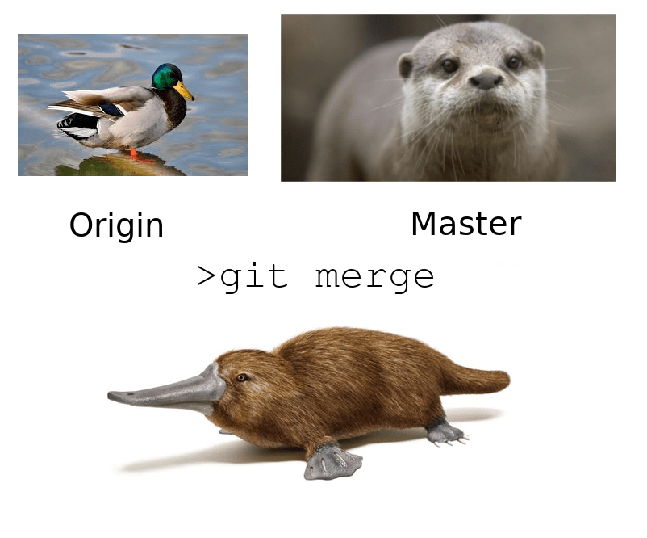
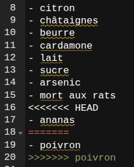

# 5. Utiliser Git avec le terminal

Git dispose d'une interface graphique, . De plus, plusieurs environnements de travail intègrent Git dont  et Rstudio. 

La majorité des utilisateurs et utilisatrices utilisent Git avec leur terminal de commandes. 
Il existe une grande variété de terminaux qui permettent d'accéder directement au shell de l'ordinateur et de lui envoyer des instructions avec des lignes de commande sans passer par une interface graphique. 

## Ouvrir le terminal 

- Windows 10+ : shift + clic droit, dans le menu, choisir "ouvrir la fenêtre powershell" ou bien entrer "cmd" dans le menu démarrer. 
- GNU/Linux : Ctrl + Alt + T  
- MacOs : Cliquez sur l’icône Launchpad  dans le Dock, saisissez Terminal dans le champ de recherche, puis cliquez sur Terminal.

Dans les manuels, le signe $ en début de ligne indique qu'une commande doit être réalisée dans le terminal de commandes (il ne fait pas partie de la commande à copier/coller)

::: {.callout-caution}
## copier / coller depuis / vers un terminal

Ctrl + C et Ctrl + V ne suffisent pas pour copier ou coller dans un terminal par défaut. Il faut ajouter la touche shift (Ctrl + shift + C ou Ctrl + shift + V) ou ⌘ + shift + C ou V pour MacOs

Pour récupérer la commande précédente, utiliser la flèche vers le haut
:::

## configurer Git

Lorsqu'on initie un dépôt (ou ) on ouvre un  dans Git qui au départ va être vide. On va enregistrer dans cet index des fichiers soumis au contrôle de versions ainsi que des opérations réalisées sur ces fichiers.

Dans un premier temps, on va utiliser git indépendamment de la forge

Lorsqu'on télécharge Git pour Windows, l'installateur nous pose un certain nombre de questions auxquelles on ne saura pas forcément bien répondre la première fois, ce n'est pas grave, on peut toujours changer ces paramètres après sans avoir à tout réinstaller. 

Dans la perspective d'une collaboration avec d'autres personnes, il est important de signer les révisions et ajouts qu'on fait avec Git et pour cela il faut une fois pour toutes donner des informations sur soi à l'application : 

```shell
$ git config --global user.name "Damien Belvèze"
$ git config --global user.email "damien.belveze@univ-rennes.fr"
```
Une commande git c'est trois choses : 

la référence au **programme git** + un **verbe** + une **option** ; 

ici on a bien git + config (le verbe) + une option --global

**--global** signifie que ce nom et ce mail seront attribués à l'ensemble des révisions réalisées avec Git et pas seulement les révisions liées à un projet en particulier.

Git nécessite parfois l'ouverture d'un éditeur pour écrire des messages permettant de donner du sens à certaines actions (une révision ou *commit*, une fusion ou *merge*)

L'installateur de Windows demande quel éditeur Git doit utiliser ; pour des raisons de simplicité on peut choisir l'éditeur Notepad qui est par défaut présent dans Windows +10

On peut aussi changer d'éditeur avec une ligne de commande : 

```shell
$ git config --global core.editor "notepad -w" ou 
```
```
$ git config --global core.editor "notepad --wait"
```

Dans les commandes ci-dessus on demande à Git d'ouvrir l'éditeur notepad (par défaut sur les ordinateurs Windows) dès qu'il doit ouvrir un éditeur ; c'est préférable au fait de le laisser ouvrir son éditeur de référence qui est Vi si on ne connaît pas Vi et ses raccourcis. 


## init, add, commit, status


**initier un dépôt git**

-   créer un dossier
-   initialiser un repository git en entrant la commande suivante dans votre terminal

```bash
git init
```

Ajouter un fichier dans ce dossier

copier-coller les ingrédients de son plat favori dans le fichier.

**enregistrer les modifications dans l'**

Ajouter le fichier à l'index :

```bash
git add <nom du fichier>
```

La commande inverse consiste à retirer du tree un fichier. Pour cela on va utiliser la commande ``git rm`` (*rm* pour remove). 
Pour retirer les fichiers et sous-dossiers présents dans un dossier "ajeter", la commande à passer sera : 

```bash
git rm -rf ajeter/*
# -rf permet de procéder de manière récursive l'opération dans les sous-sous dossiers, etc.
```
Ainsi si vous avez supprimé un fichier. Vous pouvez le récupérer depuis l'arbre de travail, en revenant à un commit d'avant la suppression. Pour le supprimer définitivement de l'arbre de travail, il faut penser à utiliser ``git rm``

ajouter un autre fichier, avec la liste des aliments qu'on déteste le plus, ajouter ce fichier au tree packager (=committer) le tout (`git commit -m "écrire un message"`)

## status, log, blame

Dans le fichier de sa recette favorite, ajouter un poison (arsenic, strychnine, ritaline, curare, ce que vous voulez)

`git status` permet de voir les fichiers qui ne sont pas encore dans le tree

ajouter à l', créer un nouveau commit

`git log`permet de voir l'ensemble (ici 2 seulement) des  Pour avoir un  par ligne, compléter la commande avec l'argument --oneline : `git log --oneline`

`git blame` permet d'avoir accès à davantages d'informations que git log ou de sélectionner un fichier, voir une ou plusieurs lignes du fichier sur lesquelles on souhaite obtenir une information. Comme son nom l'indique, pour un projet collaboratif, il s'agit d'identifier quel contributeur ou contributrice blâmer pour un changement intempestif dans le code source. 

La commande permet de : 
- sélectionner un ensemble de modifications (par commit, par date, par fichier et de manière combinée)
- de savoir qui est l'auteur de la modification et d'obtenir son mail pour avoir des éclaircissements
- de savoir quand la modification a été faite. 
- de savoir en quoi consiste cette modification. 

Par exemple, pour savoir qui est à l'origine des modifications survenues entre la ligne 18 et la ligne 24 du document presentation.md , je peux envoyer la commande suivante : 

```bash
git blame commandes_base_git.qmd -L 18,24
```

Pour observer les modifications réalisées sur un document en particulier (mettons le README.md) le 25 février 2026, la commande à passer est : 

```bash
git blame --since="2026-02-25" --until="2026-02-25" README.md
```
Si on veut stopper l'affichage des lignes dans le terminal on peut "tuer"(kill) le processus dans le terminal avec un Ctrl+Z.

## gérer le roll-back avec revert

Pris de remords, vous souhaitez revenir à la version précédente, sans le poison.

Pour revenir à la version précédente, il faut déplacer le curseur HEAD sur le  précédent (qui ne contient pas le poison)

le git log vous indique où actuellement est ce curseur (HEAD = version dans l'espace de travail, par défaut cette version est enregistrée dans le dernier )

on pourrait utiliser une fonction qui supprime le dernier  pour revenir au précédent 

``git reset' <commit>``

Par contre ça supprime définitivement de l'arbre de travail le fichier modifié dont on ne veut plus. Après tout, une nouvelle avanie subie pourrait nous faire changer d'avis une fois de plus et nous pousser à remettre le poison dans la recette.

Par ailleurs, quand on travaille à plusieurs, il vaut mieux éviter de supprimer des  (ce que fait l'option `git reset`). On va donc utiliser `git revert` qui crée un nouveau , annulant les changements opérés par un précédent.

L'opération `git revert` consiste en trois choses : 
1. indiquer l'importance du roll-back (git revert -n HEAD)  
2. Rédiger un message pour expliquer le motif du revert  
3. valider le message et quitter l'éditeur  

Lorsqu'on fait la manip depuis le terminal sur Ubuntu, c'est par défaut l'éditeur vi qui s'ouvre. sauvegarder et quitter sur vi se fait avec la commande `:wq` Mais il faut connaître les raccourcis clavier. Si on veut utiliser un autre éditeur pour cette tâche de rédaction des messages de  on peut le faire avec la commande :

```bash
git config --global core.editor "code --wait"
# utilise VScode (code) au lieu de Vi pour rédiger les messages de merge et conflits
```

`git revert HEAD` : crée un  qui reprend l'état du précédent  (équivalent à `git revert -1 HEAD`)

`git revert -3 HEAD` : crée un  qui reprend l'état du 3e 

`git revert HEAD 606dc1f` : retour au  606dc1f


## créer et gérer des branches

A partir du tronc commun de notre recette, nous allons faire deux variantes : l'une avec de l'ananas (variante qu'on va appeler 'ananas'), l'autre avec du poivron (variante qu'on va appeler 'poivron'). 
Les  de git vont nous permettre de faire bifurquer notre recette : on laisser la variante ananas dans la branche actuelle (la seule pour l'instant, dénommée *main*) et on va créer une nouvelle branche pour la version 'poivron' qu'on va appeler en toute simplicité la  *poivron*

Pour créer une  poivron, passer la commande : 

```bash
git branch -M poivron
```
la  est créée. C'est dans la  créée qu'on opère à présent. Pour s'en convaincre, on peut passer ``git branch`` on aura comme résultat 'poivron'. 
Dans le fichier qui contient la recette ajouter l'ingrédient "poivron", enregistrer.
A présent, on va se remettre sur la  *main* en passant la commande : 

```bash
git checkout main
```
Dans le fichier de la recette, on ne devrait pas voir le poivron, mais on va ajouter l'ananas. enregistrer le fichier. 

## fusionner des branches



A présent, on dispose de deux variantes différentes de la meême recette dans deux . 

Si ces deux variantes sont agréables à notre goût, on peut tenter une fusion (en espérant que le poivron et l'ananas se marient bien) ; pour cela on va fusionner ces deux . 

la commande ``git merge`` permet de fusionner les  d'un même . 

La fonction `git merge` identifie une  principale (par défaut, la  *main*, ici celle de l'ananas) et va y ajouter les modifications apportées à la  mergée (*poivron*) depuis la bifurcation en créant un nouveau . 

Si on passe cette commande, on va ainsi pouvoir fusionner ces deux  : 

```
git merge poivron
```
Comme les deux , à la même ligne dans le même fichier, présentent des valeurs différentes, il y a un conflit de versions à résoudre. 
Automatiquement, dans l'éditeur qui a été défini plus haut comme éditeur par défaut de git, le fichier qui porte le conflit s'ouvre et présente des signes de cette nature (ici capture d'écran de Rstudio) : 



la ligne 18 sert de séparateur entre les deux versions possibles. La première version, celle de la  *main* est comprise entre <<<<<<<<<< HEAD et ===== et celle de la branche poivron entre ===== et >>>>>>>>>> poivron. 
On peut résoudre le conflit en conservant l'un ou l'autre des ingrédients ou les deux. Ici on va conserver les deux. On supprime les balises de conflit et on enregistre le fichier. 

Ensuite pour résoudre complètement le conflit, il faut faire un nouveau  avec la fusion opérée. 

Après quoi, on pourra continuer de passer d'une  à l'autre. les modifications de la branche *poivron* ont été intégrées à la  *main*. 


```{mermaid}

gitGraph
    commit id: "ingrédient 1"
    commit id: "ingrédient 2"
    commit id: "ingrédient 3"
    branch poivron
    checkout poivron
    commit id: "ajout poivron"
    checkout main
    commit id: "ajout ananas"
    merge poivron
    commit id: "ananas + poivron"
```

## faisons le point

On a vu que, soit depuis un terminal, soit en étant intégré à un éditeur, Git vous permet de versionner des fichiers au sens où : 
- vous pouvez ajouter retrancher des fichiers à un espace de travail
- identifier des versions, revenir à des versions précédentes (tous les  sont conservés)
- identifier qui a modifié quoi à quel moment
- faire des tests en utilisant le système de , fusionner des versions différentes d'un même fichier. 

En théorie, si le dossier est présent sur un serveur partagé. des collaborateurs.rices pourraient conduire les mêmes opérations en étant connecté.e.s à ce serveur. 

Pour faciliter ce travail de collaboration et ajouter des services à ceux que nous avons déjà listés (essentiellement compris dans le service de contrôle de version), les forges existent et ce sont elles à présent qui vont vous êtes présentées, en particulier deux forges construites avec le logiciel libre gitlab. 

Il est temps maintenant, sans perdre de vue Git de revenir à notre forge. 