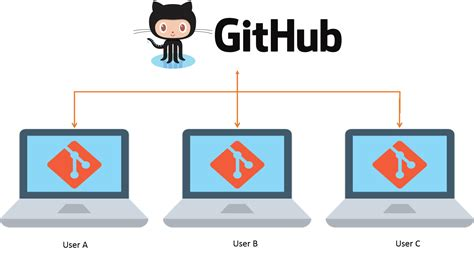

Cette formation de 2 heures est destinée aux étudiants et personnels de bibliothèque qui participent au *stretching numérique*

Objectifs de la séance : 

- utiliser un terminal de commandes
- maîtriser le contrôle de version en local  
- utiliser des éditeurs de texte basiques 
- utiliser la forge Github 
- faire le lien entre la forge et l'outil de contrôle de version git
- publier une page web depuis Github

