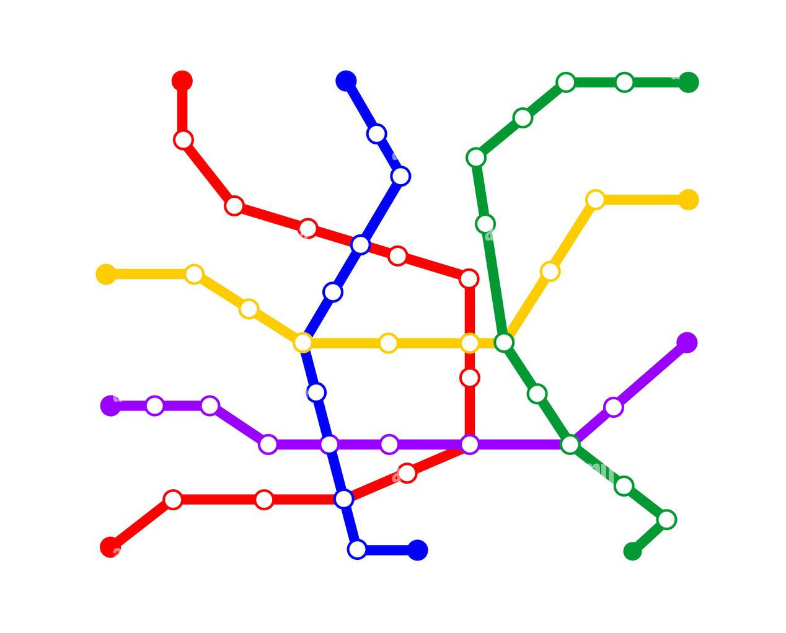

Cette formation de 3 heures est destinée aux doctorant.e.s du Collège doctoral de Bretagne

Objectifs de la séance : 

- Connaître le rôle de git et gitlab dans l'écosystème de la recherche et de la production de code source de recherche  
- utiliser git pour versionner un texte ou un code source  
- connaître les principales fonctionnalités des forges  
- utiliser une forge pour collaborer avec d'autres chercheurs et chercheuses  

