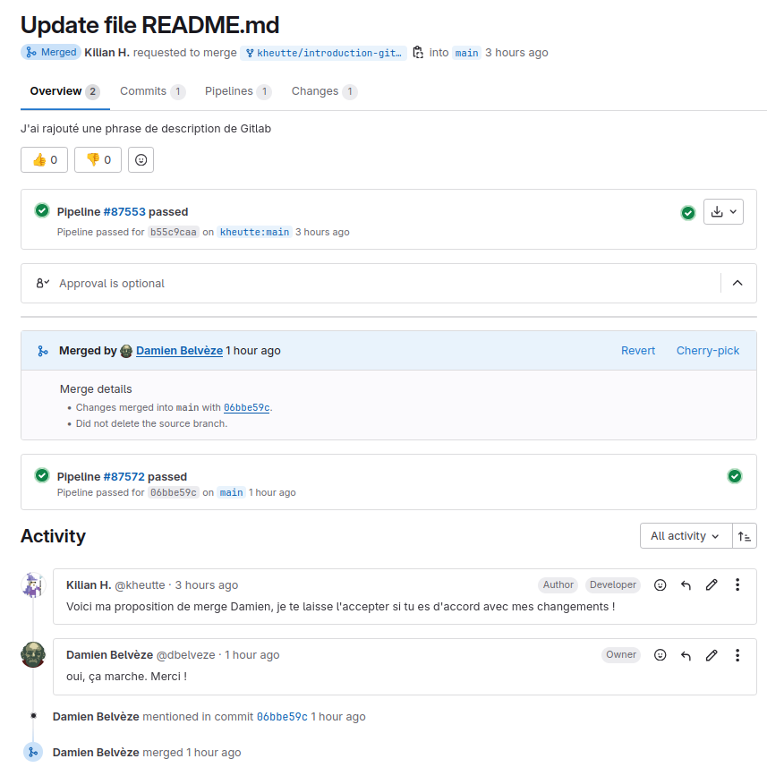

# 6. Proposer une amélioration à un code source ou à un texte

## faire un fork 

Les Apprenant.e.s se constituent en binôme. 
Chaque membre du binôme va faire une copie, un  du  de l'autre. 
Le but est de faire des modifications à la liste d'ingrédients du binôme et de lui proposer ensuite ces changements. 

Pour faire un  d'un projet, suivre les instructions ci-dessous:

```{=html}
<iframe
src="assets/merge_request.pdf"
width="100%"
height="600px"
style="border:none"
title="Embedded PDF Viewer"
></iframe>
```

ou <a href="assets/merge_request.pdf" download>téléchargez-le fichier</a> pour le lire dans votre propre visionneuse de PDF

<!-- texte remplacé par instructions de Kilian 

## faire une merge request

Lorsque vous avez fini ces changements, vous pouvez les soumettre à votre binôme en lui envoyant votre demande de modification, ce qu'on appelle faire une 

Dans le  forké, aller dans *Merge Requests*, sélectionner la  depuis le repo forké repo comme  source, et selectionner la  principale du  originel (pas le forké) comme   cible -> Comparer les branches; puis Sélectionner l'utilisateur auquel on va assigner cette *merge request*
Soumettre enfin la *merge request*.

L'auteur/trice original.e du projet devrait voir la *merge request* apparaître dans la forge. 

Il/elle peut demander des commentaires à qui a fait cette requête pour obtenir des précisions. Il/elle peut voir les changements opérés dans le fork par rapport au code source original
Il/elle peut intégrer ou refuser d'intégrer ces changements en acceptant ou refusant la *merge request*. 

-->

Réponse faite à cette demande de fusion : 



